# FHIR CRUD operations

## FHIR CRUD references:

- Introduction
- HTTP post clients
- Getting first resource from the FHIR server
- Updating resource in the FHIR server
- Adding a new resource to the FHIR server
- Deleting the resource in the FHIR server
- Group Discussion and Q&A

## Introduction

In this tutorial, we will walk through the basic CRUD operations.

CRUD stands for Create, Read, Update & Delete. These are the four main actions that you will use to interact with the FHIR resources within a FHIR server.

REST stands for 'Representational state transfer' and RESTFul just means a system that conforms to the constraints of REST.

Understanding these four operations is essential to working with any RESTful service which a FHIR server is an implementation of.

## Step 1: Http post clients

The simplest way to retrieve and send FHIR resources to and from a FHIR server is to use a Http post client.
The most popular clients are Postman and Insomnia. Each of them has pros and cons.

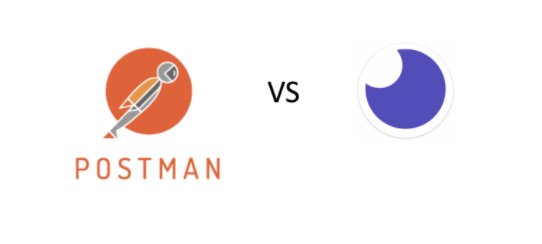

What is a post client? It is a tool that allows you to talk to servers using Hypertext Transfer Protocol (HTTP).
When you use an internet browser the browser is converting your clicks and text into HTTP to send to the web server and the server returns content,
your web page, back via HTTP. The browser then interprets the content as a web page and displays it on screen. When we work with FHIR the content is not a web page but rather XML or JSON.
Our web browser is not very good at displaying raw XML or JSON so we need a HTTP client so that we can talk in HTTP and view the XML or JSON returned.

If you don’t want to use any post clients, you can use curl.
Curl is a tool which can be used to execute HTTP requests from the command line, and is commonly installed on Linux/OSX systems.
Terminal command: man curl

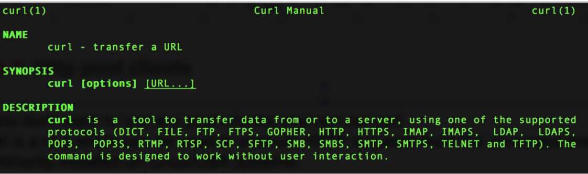

Example of GET request with curl: curl -v GET https://try.smilecdr.com:8000/Patient/37078

- -v [options] provide more details

The good example of using the Postman application

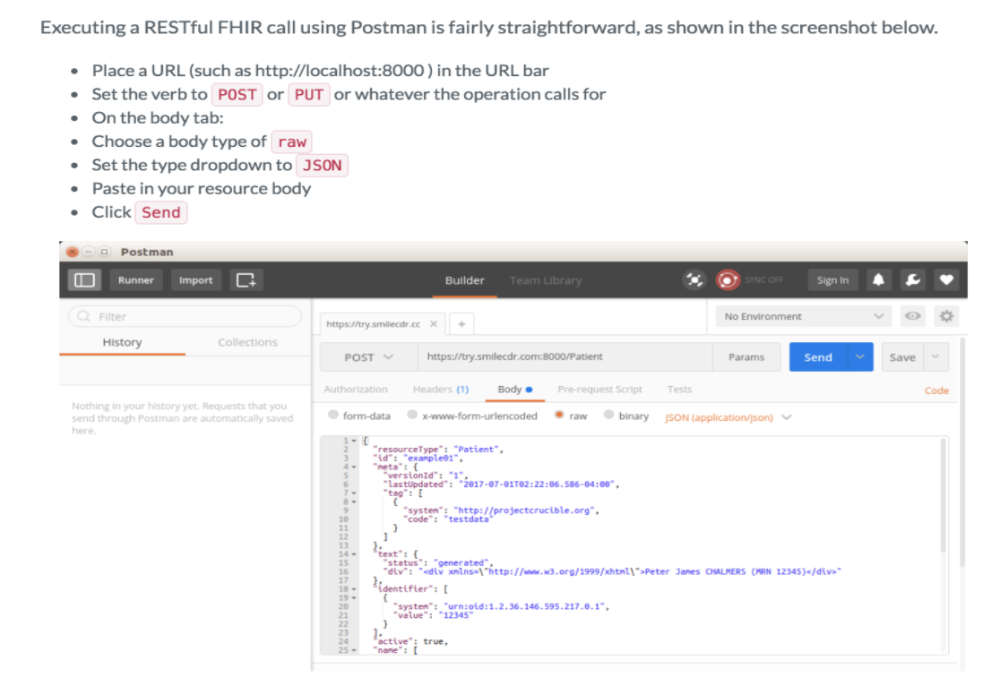

## Step 2: Getting your first resource from the FHIR server

### FHIR Read / vRead
If you know the ID of a resource on a FHIR server, you can read back the most recent version of that resource by performing a read operation.
The read uses an HTTP GET against the URL [baseUrl]/[resourceType]/[id].

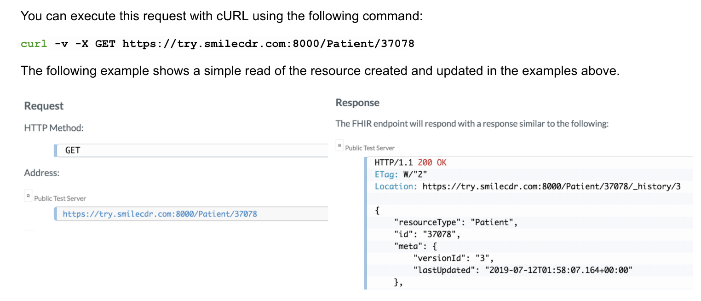

You can also include a version string in the URL in order to request a specific version of the resource by performing a vread operation.
The vread uses an HTTP GET against the URL [baseUrl]/[resourceType]/[id]/_history/[versionId].
You can execute this request with cURL using the following command:

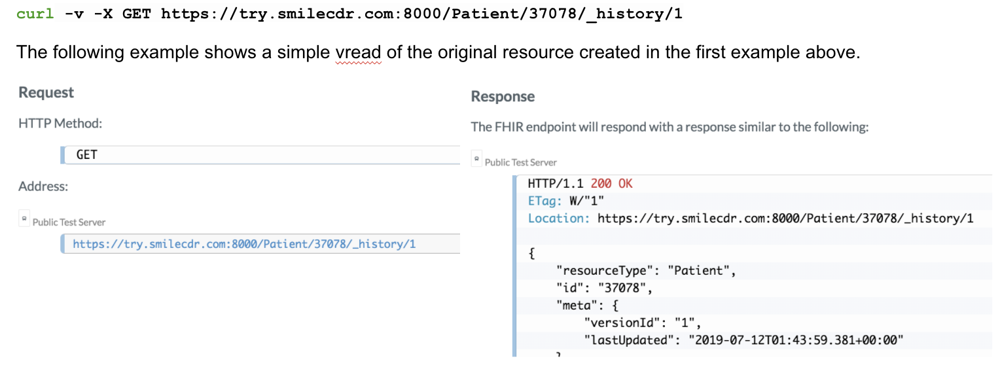

## Step 3: Updating your resource in the FHIR server

### FHIR update
You can update an existing resource on a FHIR server by performing an update operation. The update uses an HTTP PUT against the URL [baseUrl]/[resourceType]/[id].
This PUT should have (at a minimum) a Content-Type header that specifies the MIME type of the payload.
We used the Accept property to tell the server the format (XML or JSON) we wanted to be returned by the server.

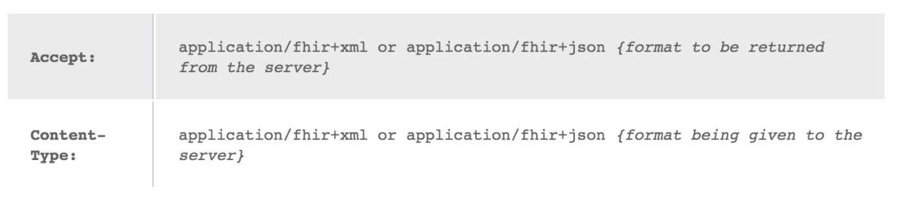

The following example shows a simple update using a JSON payload. In this example, we are taking the previously created resource from above and updating it.
We will change the birth date and add an address. Note the ID 37078 in the URL, resource body and headers. When you are trying this yourself,
make sure to use the ID that was returned from the server in the steps above.

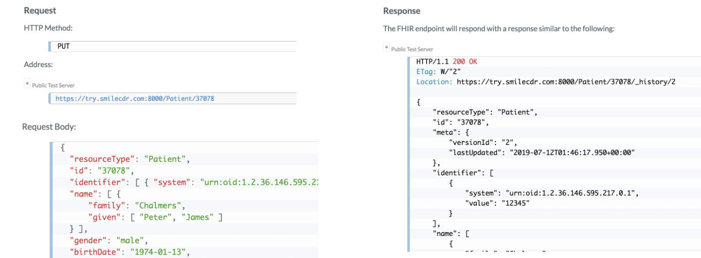

Curl example:

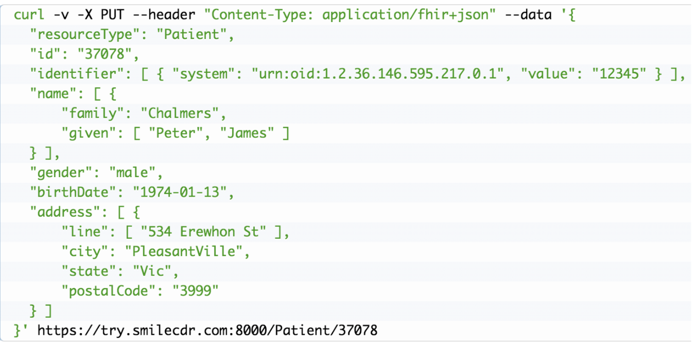

### FHIR Patch
You can patch a resource on a FHIR server by performing a patch operation. The patch uses an HTTP PATCH agaisnt the URL [baseUrl]/[resourceType]/[id].
This operation requries a Content-Type header that specifies the MIME type of the payload. For a JSON patch payload the header value would be: application/json-patch+json.
For a XML patch payload the header value would be: application/xml-patch+xml. The body of the PATCH payload must be in a specific format for JSON and XML requests.

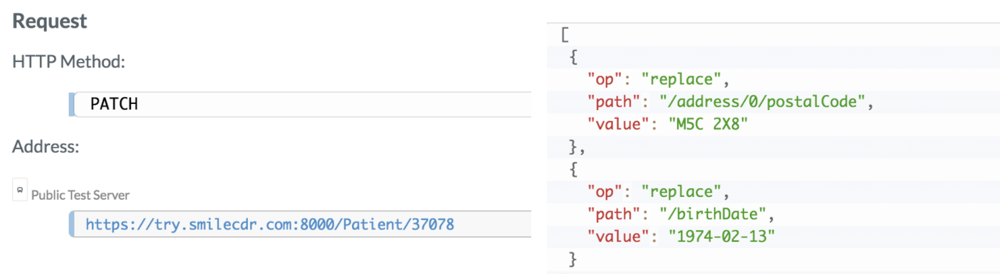

## Step 4: Adding a new resource to the FHIR server

### FHIR Create
A client may create a new resource on a FHIR server by performing a Create operation. The create uses an HTTP POST against the URL [baseUrl]/[resourceType].
This POST should have (at a minimum) a Content-Type header which specifies the mimetype of the payload. The following example shows a simple create using a JSON Payload.

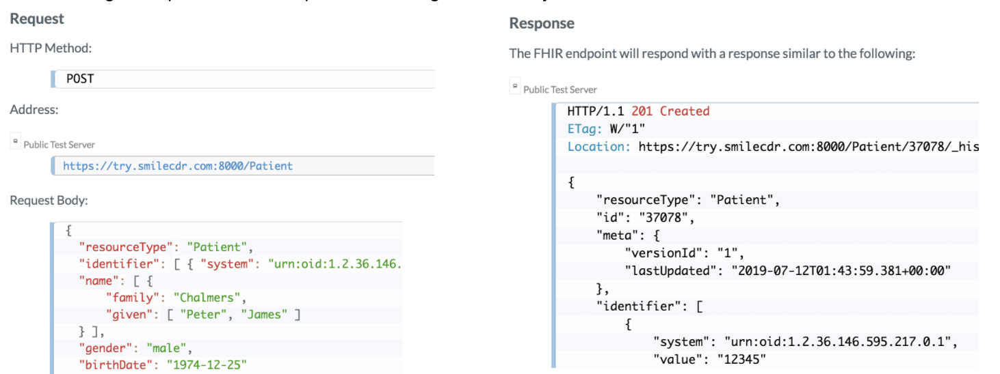

Curl example:

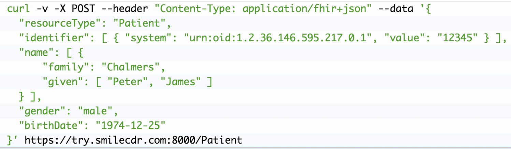

## Step 5: Deleting a resource from the FHIR server

### FHIR Delete
You can delete a resource on a FHIR server by performing a delete operation. The delete uses an HTTP DELETE against the URL [baseUrl]/[resourceType]/[id].
This operation performs a logical delete, which has a specific set of semantics: The resource is marked as deleted, and it will no longer appear in search results.
The version number of the resource is incremented (essentially, a new deleted version is created). Previous versions of the resource are not physically deleted.
The resource may be un-deleted by updating it again. The following example shows a simple delete of the resource created and updated in the examples above.
Curl example: curl -v -X DELETE https://try.smilecdr.com:8000/Patient/37078

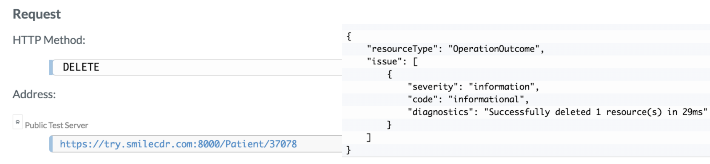

### Cascading Delete
With cascading deletes enabled, a user can perform the delete on Patient/A and all of the child resources will be deleted as well.
In order to perform a cascading delete, three things must occur: Cascading Deletes Enabled setting must be enabled on the FHIR Storage module.
Then, the user performing the operation must have the FHIR_DELETE_CASCADE_ALLOWED permission, as well as a specific permission allowing the child resource to be deleted.
For example, you might grant the user the FHIR_DELETE_CASCADE_ALLOWED and FHIR_ALL_DELETE permissions.
Finally, to perform a cascaded delete, the client HTTP request must include either a special URL parameter (_cascade) or a special header to indicate that a cascading delete is desired.

Example: DELETE /Patient/123?_cascade=delete

### Transactional Delete
The FHIR Transaction operation can be used to delete multiple resources at the same time.
This is useful if you have chains or collections of resources to delete at ones, but also can be used to delete circular references.
To delete multiple resources in a transaction, POST a Bundle such as the following to the root of your FHIR endpoint.

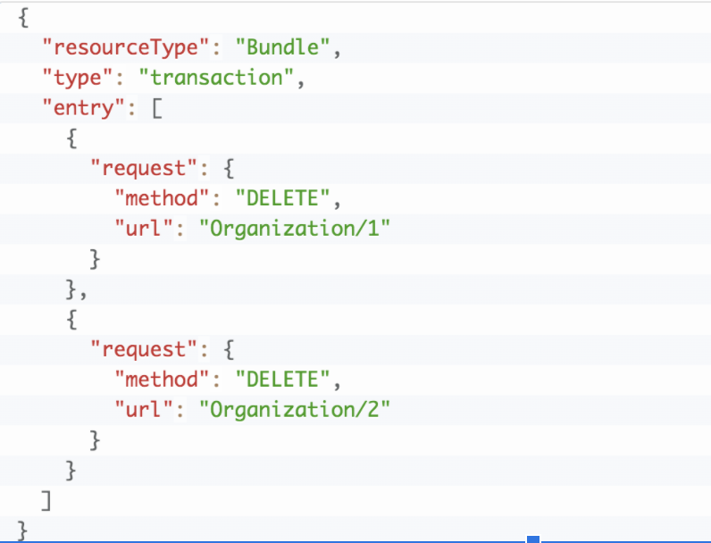

### Expunge operation ($expunge)
In some cases we need to completely delete data from the server.
The $expunge operation is a powerful operation that can physically delete old versions of resources, deleted resources, or even all data in the database.

### Instance level expunge
The $expunge operation can be invoked against a single resource instance, or even an individual version of a resource instance. If invoked at the instance level

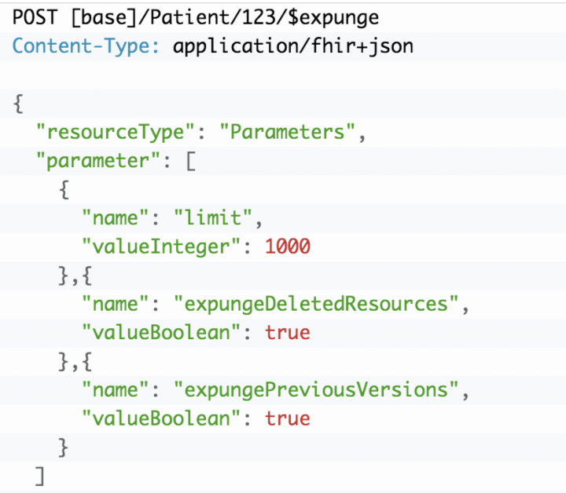

### Type level expunge
The $expunge operation can be invoked at the type level. In this mode, all resources of a given type will be processed with the same rules as at the instance level.

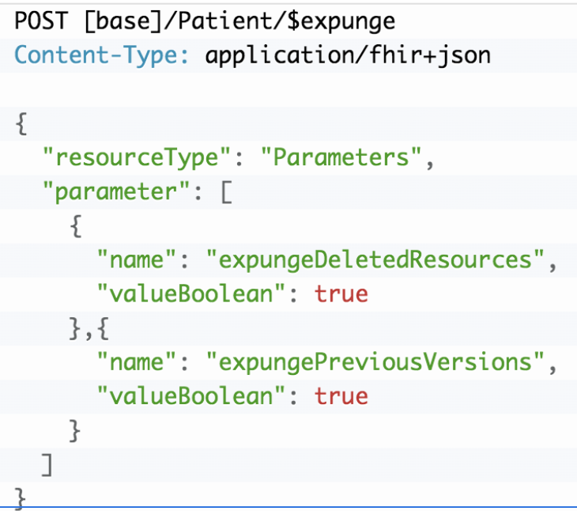

## Group discussions and QA:

1. What does idempotent means in REST api?
1. What are the basic methods used for CRUD operations?
1. Which method is used to update the resource?
1. PUT and PATCH method difference?
1. PUT and POST method difference?
1. How to update Organisation resource, any example request?
1. Write the URL to delete the patient resource.
1. Mention which markup language can be used in restful api?

