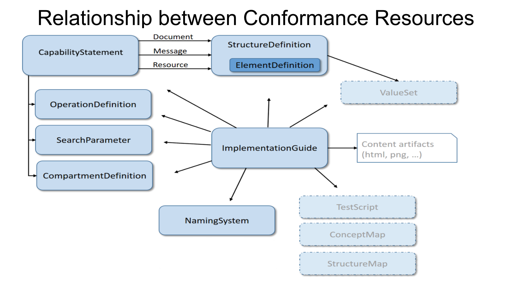

# [FHIR Profiling](https://www.hl7.org/fhir/profiling.html)

## Definition

* Adapting the FHIR specifications to a particular context of use.
* Variation in context across the world in the healthcare ecosystem

## Conformance Module 

* Conformance resources represent the adaptations in a computable fashion
* **Implementation Guide (IG)** :- describes how FHIR is adapted to support a certain use case. 
* **Capability Statement** :- Uses  Conformance resource to document how a client or server has implemented FHIR 

## Conformance Resource

* **StructureDefinition Resource** :- Defines how resources, extensions and data types are used.
* **MessageDefinition Resource** :- Describes messages that can be sent or received
* **OperationDefinition Resource** :- Describes addition operations in addition to the base specifications
* **SearchParameter Resource** :- Describes additional search capabilities in addition to the base definition
* **CompartmentDefinition Resource** :- Describes a logical grouping for resources (used in access control or search)

## StructureDefinition Resource 

* This resource is used to define FHIR data structures :- 
    * Resource
    * Extension 
    * DataTypes
* Implementors can use this resource to make constraints on the base definition

#### StructureDefinition Resource Properties 

* **url** :- Unique identifier for StructureDefinition
* **name** :- Name of the StructureDefinition
* **baseDefinition** :- base of the current StructureDefinition
* **Snapshot** :- This is a fully calculated form of structure
* **Differential** :- Only contains constraints made onto the base structure, anything not mentioned in statement is implied to have no changes from the base 

## $snapshot operation

* Generates a StructureDefinition instance with a `snapshot` based on the differential in a specified StructureDefinition.
* In orde to generate a valid `snapshot`, `baseDefinition` of a StrcutureDefinition must have a valid snapshot.
* Query Structure :- 
    * POST :- [base]/StructureDefinition/$snapshot
    * GET, PUT :- [base]/StructureDefinition/[id]/$snapshot

## Slicing 

* Slicing is basically restrictions on each element of a resource property with `cardinality >= 1`.
* **Discriminator** :- In order to differentiate between slices, each resource element which is slices will include a property known as the `discriminator` to tell them apart. The `discriminator` consists of two mandatory fields :- 
    * Type :- Slice Type 
    * Path :- FHIRPath expression

#### Slice Types

| Type    | Use                                             | Scenario                                                                                     |
|---------|-------------------------------------------------|----------------------------------------------------------------------------------------------|
| value   | Static comparison                               | Usually used for comparing static codes                                                      |
| exists  | If the property exists & then another condition | Usually used for Backboneelements                                                            |
| pattern | Comparing pattern                               | Usually used for CodeSystems like LOINC, SNOMED CT                                           |
| type    | value[x]/pattern[x]                             | Usually used for resource properties which support more than one datatype or primitive types |
| profile | Validate data type against profile              | Used for validating datatype with a custom profile                                           |

#### Slicing Rules

 When an element of a fixed cardinality m..n is sliced, the following rules apply: - 
* Each slice cannot have a greater cardinality than the maximum number of slices allowed.
* The sum of the maximum cardinalities can be larger than n.
* The sum of the minimum cardinalities must be less or equal to n.
* Each individual slice can have a minimum cardinality of 0 (less than m - the only situation where this is allowed), but the total number of elements in the instance must still be greater or equal to m.

## $validate Operation 

* The validate operation checks whether the attached content would be acceptable while performing CRUD operations.
* Query structure :- 
    * POST :- [base]/Resource/$validate
    * GET, PUT, DELETE :- [base]/Resource/[id]/$validate

## Extensions

* Creating extensions inside a profile by using a StructureDefinition resource
* Define context i.e. where can it be used, target structure: resource, datatype, extension
* Example :- [US Core Patient Profile](https://www.hl7.org/fhir/us/core/StructureDefinition-us-core-patient.html)
