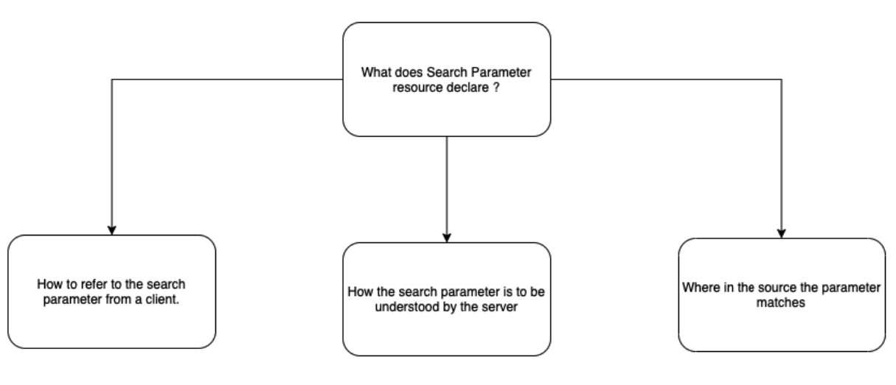
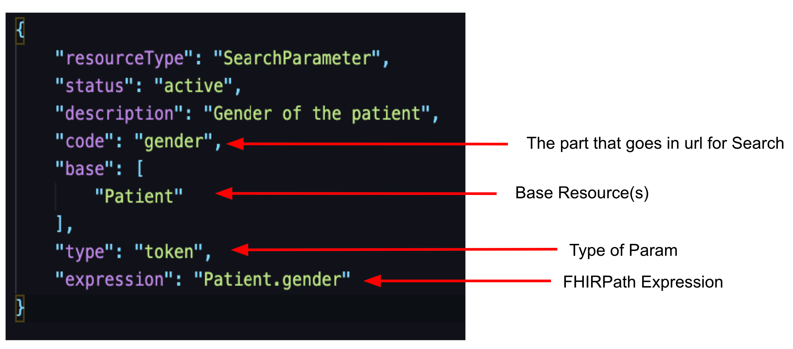
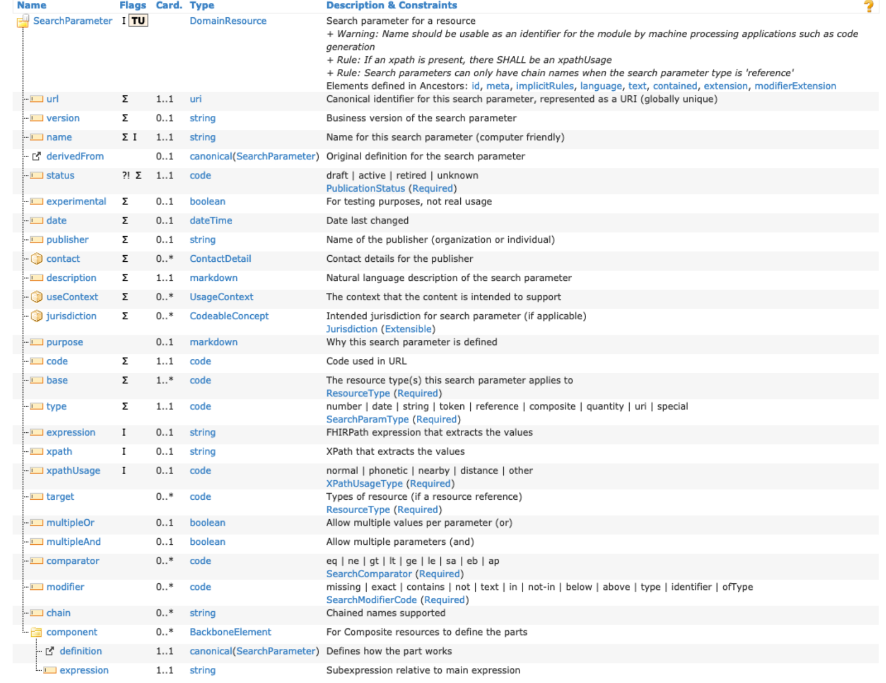

# FHIR Search Parameters

## Definition

- A search parameter defines a named search item that can be used to search/filter on a FHIR resource.
- A SearchParameter resource is a FHIR resource that can be used to define/describe a search parameter supported by a given server.

## What does SearchParameter resource declare ?

## Default SearchParameter for Patient.gender

Default Search Parameter Registry :- [http://hl7.org/fhir/searchparameter-registry.html](http://hl7.org/fhir/searchparameter-registry.html).

## SearchParameter Types

| Type          | Definition                                                                                                                                                                                                                                                                                                                                                                                                                                                                                |
|---------------|-------------------------------------------------------------------------------------------------------------------------------------------------------------------------------------------------------------------------------------------------------------------------------------------------------------------------------------------------------------------------------------------------------------------------------------------------------------------------------------------|
| Number        | Whole number or decimal                                                                                                                                                                                                                                                                                                                                                                                                                                                                   |
| Date/DateTime | Date and time parameter formatted as:<ul><li> yyyy-mm-ddThh:mm:ss[Z\|(+\|-)hh:mm]</li></ul>                                                                                                                                                                                                                                                                                                                                                                                                                 |
| String        | Simple string. Case and accent insensitive. May contain spaces.                                                                                                                                                                                                                                                                                                                                                                                                                           |
| URI           | Uniform Resource Identifier. Example:<ul><li> http://acme.org/fhir/ValueSet/123 </li><li>urn:oid:1.2.3.4.5</li></ul>                                                                                                                                                                                                                                                                                                                                                                                                      |
| Token         | Used for values that are part of a code system or namespace.  Includes:<ul><li> Coding</li><li> CodeableConcept</li><li> Identifier</li><li> ContactPoint</li><li> code</li></ul> Can include both a code system and code value or just a code value.  Examples. <ul><li>identifier= http://acme.org/patient\|2345</li> <li> gender=male</li><li> code=http://acme.org/conditions/codes\|ha125 </li>     </ul>                                                                                                                                                                        |
| Quantity      | Used for quantity values that include a numeric value and possibly a unit of measure code.The unit of measure code will include a code value and optionally a code system. Examples: <ul><li>value-quantity=5.4\|http://unitsofmeasure.org\|mg</li><li> value-quantity=5.4\|\|mg</li><li> value-quantity=5.</li></ul>                                                                                                                                                                                                        |
| Reference     | Used for values that represent references between resources. For example an Observation resource will normally have a subject element which references a Patient resource for the patient that then Observation relates to.   Can include :<ul><li>ID for a local reference</li><li> Resource type + ID for a local reference</li><li> URL for an absolute reference.</li> </ul>Examples: <ul><li>subject=Patient/23  reference=http://example.org/fhir/Patient/123</li></ul>                                                                   |
| Composite     | Used in cases where a single search definition requires two or more values. SearchParameter values appear in the search request as a list of single values joined with a `$` character.   Examples: <ul> <li>result.code-value-quantity=http://loinc.org\|2823-3`$`gt5.4\|http://unitsofmeasure.org\|mmol/L</li></ul>  In the above example, the SearchParameter consists of two values, joined by `$`:<ul><li> http://loinc.org\|2823-3 (potassium observation) </li><li> gt5.4\|http://unitsofmeasure.org\|mmol/L (quantity)</li></ul> |
| _filter       | Used to specify a query expression that can be used in a Search operation. Example:<ul><li> given eq "peter" and birthdate ge 2014-10-10</li></ul>                                                                                                                                                                                                                                                                                                                                                           |
| near          | Used only with Location resource. Specifies a set of coordinates expressed as coordinates expressed as [latitude]\|[longitude]\|[distance]\|[units]                                                                                                                                                                                                                                                                                                                                       |

## SearchParameter Modifiers

<ul><li>Modifiers may be specified as a suffix to the SearchParameter values and are separated by a colon.
<ul><li>Example: gender:missing=true</li></ul></li></ul>

| Parameter Type      | Operator    | Description                                                                              |
|---------------------|-------------|------------------------------------------------------------------------------------------|
| All Parameter types | :missing    | <ul><li>True or false</li><li>Resources which are missing the parameter value.</li></ul> |
| String Parameter    | :exact      | Resources which have an exact match for the parameter, including case and character.     |
| Token Parameter     | :text       | Matches on text portion of CodeableConcept or Coding element.                            |
| Token Parameter     | :not        | Match resources that do not have the code value.                                         |
| Token Parameter     | :above      | Match where coding subsumes the search code parameter.                                   |
| Token Parameter     | :below      | Match where coding is subsumed by the search code parameter.                             |
| Token Parameter     | :in         | Match where coding is in a value set specified by the parameter.                         |
| Token Parameter     | :not-in     | Match where coding is not in the value set specified by the parameter                    |
| Token Parameter     | :of-type    | Match where identifier element is of specified type.                                     |
| Reference Parameter | :[type]     | Specify the name of the resource type for reference                                      |
| Reference Parameter | :identifier | Search by identifier rather than literal reference.                                      |
| Reference Parameter | :above      | Search for references in hierarchy                                                       |
| Reference Parameter | :below      | Search for references in hierarchy                                                       |
| URI Parameter       | :above      | Partial matching (e.g. URLs that include a version number)                               |
| URI Parameter       | :below      | Partial matching                                                                         |

## SearchParameter Prefixes

<ul><li>Prefixes can be used to vary the type of matching done for ordered parameter types such as number, date and quantity:<ul><li>GET [base]/Observation?_lastUpdated=gt2010-10-01</li></ul></li></ul>

| Operator | Description                                                               |
|----------|---------------------------------------------------------------------------|
| eq       | Value in resource matches or is contained in value for parameter          |
| gt       | Value in resource is greater than value in parameter.                     |
| lt       | Value in resource is less than value parameter.                           |
| ge       | Value in resource is greater than or equal to value in parameter.         |
| le       | Value in resource is less than or equal to value in parameter.            |
| sa       | Value in the resource starts after value in parameter.                    |
| eb       | Value in the resource ends before value in parameter.                     |
| ap       | Value in the resource is approximately the same as that in the parameter. |

## SearchParameter Resource

#### Required Elements

| Element Name | Type     | Description                                                     |
|--------------|----------|-----------------------------------------------------------------|
| url          | uri      | Canonical identifier for the resource                           |
| name         | string   | Computer friendly name for the resource                         |
| status       | code     | Status of the resource                                          |
| description  | markdown | Natural language description for the search parameter           |
| code         | code     | Code used to reference the search parameter in a search request |
| base         | code     | Resource type(s) that this search parameter applies to          |
| type         | code     | The data type for the search parameter value                    |

#### Optional Elements

| Element Name | Type            | Description                                                                                                                                                                                                                                                                                                                                                                  |
|--------------|-----------------|------------------------------------------------------------------------------------------------------------------------------------------------------------------------------------------------------------------------------------------------------------------------------------------------------------------------------------------------------------------------------|
| expression  | string  | FHIRPath expression used to extract an element from a resource. <ul><li>Example: Condition.subject</li></ul> |
| xpath       | string  | XPath expression used to extract an element from a resource.<ul><li> f:Condition/f:subject  </li></ul>       |
| multipleOr  | boolean | Whether to allow multiple values (or)                                                                        |
| multipleAnd | boolean | Whether to allow multiple values (and)                                                                       |
| comparator   | code            | A list of one or more comparators that can be supported by the SearchParameter:   eq \| ne \| gt \| lt \| ge \| le \| sa \| eb \| ap                                                                                                                                                                                                                                           |
| modifier     | code            | A list of one or more modifiers that can be supported by the SearchParameter:   missing \| exact \| contains \| not \| text \| in \| not-in \| below \| above \| type \| identifier \| ofType                                                                                                                                                                                  |
| chain        | string          | Names of one or more SearchParameters that will be chained together to form the current SearchParameter.                                                                                                                                                                                                                                                                     |
| component    | BackboneElement | Used for composite SearchParameters. Defines each of the components that can be included in the SearchParameter type. Each component includes:<ul><li> definition - a SearchParameter reference which defines this component works.</li><li> expression - a subexpression that defines how to retrieve the SearchParameter value for the definition from the parent SearchParameter’s value.</li>  |

